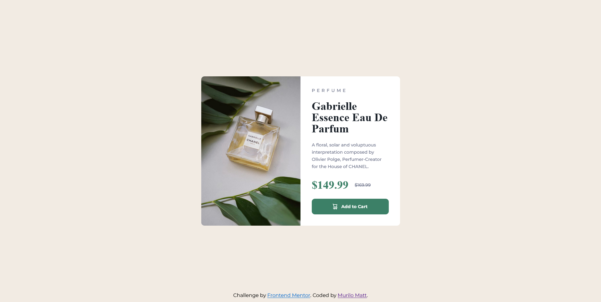

# Frontend Mentor - Product preview card component solution

This is a solution to the [Product preview card component challenge on Frontend Mentor](https://www.frontendmentor.io/challenges/product-preview-card-component-GO7UmttRfa). Frontend Mentor challenges help you improve your coding skills by building realistic projects. 

## Table of contents

- [Overview](#overview)
  - [The challenge](#the-challenge)
  - [Screenshot](#screenshot)
  - [Links](#links)
- [My process](#my-process)
  - [Built with](#built-with)
  - [What I learned](#what-i-learned)
  - [Continued development](#continued-development)
  - [Useful resources](#useful-resources)
- [Author](#author)
- [Acknowledgments](#acknowledgments)

## Overview

### The challenge

Users should be able to:

- View the optimal layout depending on their device's screen size
- See hover and focus states for interactive elements

### Screenshot

### Links

- Solution URL: [My Solution](https://your-solution-url.com)

## My process

### Built with

- Semantic HTML5 markup
- CSS custom properties
- Flexbox
- Mobile-first workflow
- SASS

### What I learned

I learned how to use `@use` i SASS, and i used BEM methodology to name my classes.

### Continued development

I will focus on my sass files structure.

### Useful resources

- [BEM methodology in portuguese](https://desenvolvimentoparaweb.com/css/bem/) - This helped me applying the BEM methodology in my code.

## Author

- Frontend Mentor - [@yourusername](https://www.frontendmentor.io/profile/MuriloMatt)

## Acknowledgments

I want to thank [Bernardo Poggioni](https://www.frontendmentor.io/profile/R3ygoski) for the tips he's giving me. 
